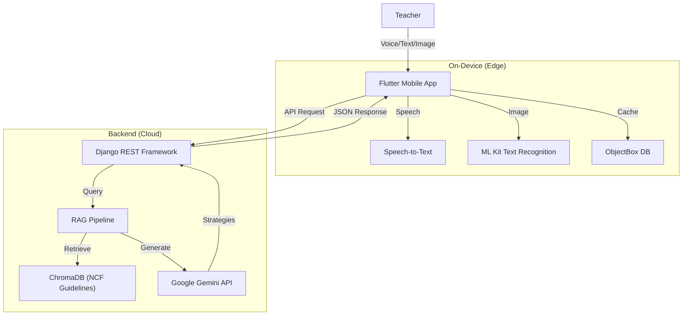
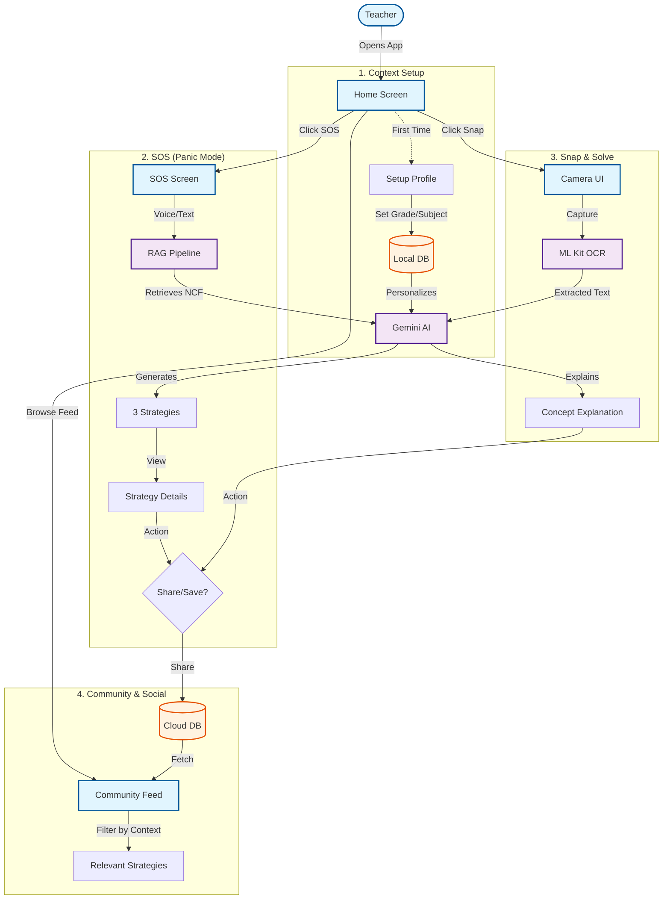
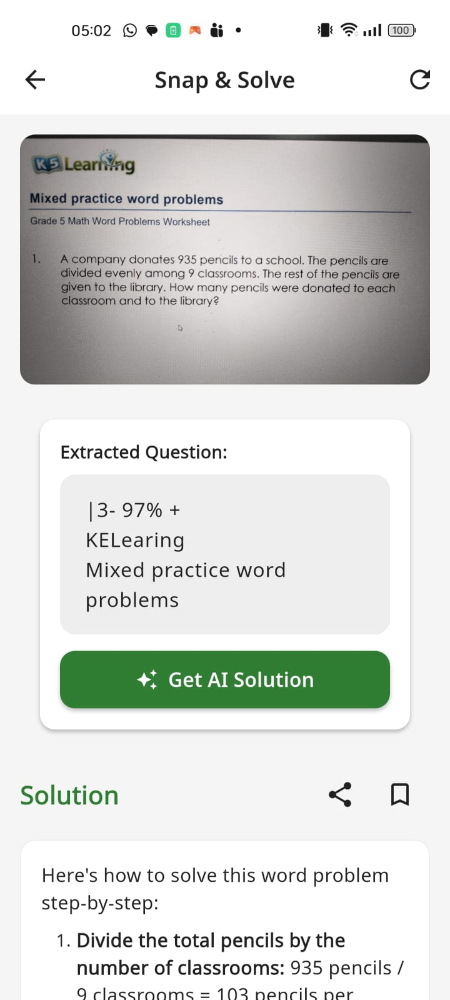
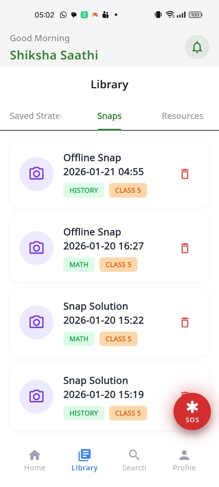
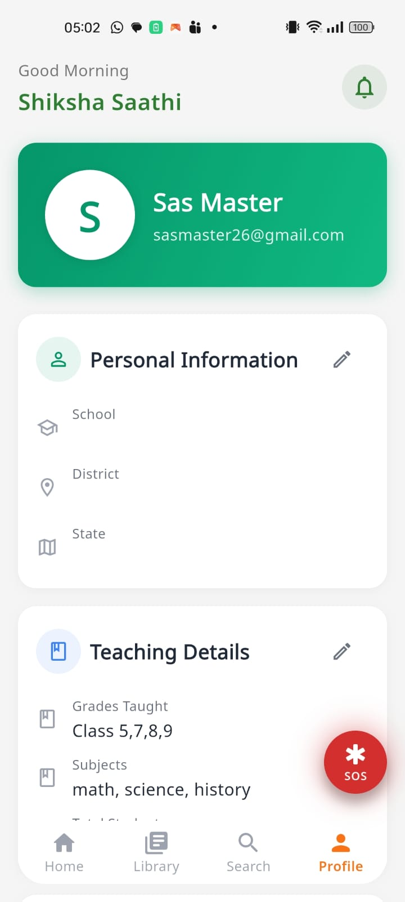

# 🏆 Shiksha Saathi: AI-Powered Teaching Companion
>
> **HackerEarth Hackathon Submission - Theme 1: Teacher Professional Development**

Shiksha Saathi (Education Companion) is an intelligent, offline-first mobile application designed to empower government school teachers in India. It addresses the critical gap between **teacher training** and **classroom implementation** by providing real-time, context-aware pedagogical support.


---

## 🚀 Problem Statement & Solution

**The Challenge (Theme 1):**
Teachers often struggle to apply training concepts in real-time classroom scenarios due to:

* Lack of immediate feedback or support.
* Disconnect between theoretical training (NCF/NEP) and practical challenges.
* Inconsistent evaluation and monitoring.

**Our Solution:**
**Shiksha Saathi** acts as a 24/7 personal pedagogy coach that lives in the teacher's pocket. It uses **Generative AI** to translate complex NCF 2023 guidelines into actionable, bite-sized teaching strategies instantly. It also fosters a community of practice where teachers can learn from each other.

### Key Differentiators

* **Community Drive**: Build a repository of "What Works" in Indian classrooms.
* **Context-Aware**: Adapts strategies based on Grade, Subject, Class Size, and Time Available.
* **Hybrid AI Architecture**: Combines **On-Device AI** (low latency, privacy) with **Cloud GenAI** (deep reasoning).
* **Offline First**: Core features work without internet, syncing when online.
* **Multilingual**: Fluent in English, Hindi, and Hinglish.

---

## 🏗️ Architecture & GenAI Strategy

### 🧠 AI Strategy: Hybrid Intelligence

We utilize a dual-layer AI approach to balance performance, privacy, and capability:

| Layer | Technology | Function |
|-------|------------|----------|
| **1. Cloud GenAI (Deep Reasoning)** | **Google Gemini 1.5** | Generates complex pedagogical strategies, translates NCF guidelines into actions, and handles open-ended "Snap & Solve" queries. Powered by **RAG (Retrieval-Augmented Generation)**. |
| **2. On-Device AI (Edge)** | **Google ML Kit** | **OCR**: Instantly extracts text from textbooks/worksheets for "Snap & Solve". <br> **Speech-to-Text**: Converts spoken teacher queries to text locally for low latency. |

### 📐 System Architecture

#### High-Level Data Flow



#### RAG Pipeline (Retrieval-Augmented Generation)

To ensure all advice is pedagogically sound and compliant with national standards, we ground Gemini's responses in the **National Curriculum Framework (NCF) 2023**.

1. **Ingestion**: NCF PDFs are parsed and chunked.
2. **Embedding**: Chunks are embedded using SentenceTransformers and stored in **ChromaDB**.
3. **Retrieval**: Teacher's query fetches relevant NCF guidelines.
4. **Generation**: Gemini generates 3 specific strategies (Quick, Interactive, Visual) based on the retrieved guidelines + Teacher's current context (Grade/Subject).

### 🔄 Feature Workflows

How a teacher interacts with the app features:



---

## ✨ Key Features

### 1. 🆘 S.O.S (Save Our Session)

* **Scenario**: Class is losing focus, or a concept isn't clicking.
* **Action**: Teacher speaks/types the problem (e.g., "Kids not understanding fractions").
* **AI Output**: 3 instant, NCF-aligned strategies ranging from 2 mins to 10 mins.
* **Tech**: RAG + Gemini.
* **Flexibility**: context can be set to any temporary value regardless of any app-level context

### 2. 📸 Snap & Solve

* **Scenario**: Teacher finds a difficult paragraph in a textbook.
* **Action**: Snaps a photo.
* **AI Output**: Explains the concept simply and suggests how to teach it.
* **Tech**: ML Kit (OCR) + Gemini.

### 3. Community Feed (Strategy & Snap Sharing)

* **Scenario**: Teacher wants to see what's working for others in similar contexts.
* **Action**: Browses a feed of strategies and snaps shared by other teachers, filtered by their active context (Grade/Subject).
* **Tech**: Django Feed API + Context Filtering.

### 4. 🌍 Context Card

* **Action**: Teacher sets their profile once (e.g., "Grade 4, Math, Hindi Medium").
* **Result**: All AI responses are automatically personalized to this context.

### 5. 🗣️ Multilingual Support

* Full UI localization (English/Hindi).
* AI responses generated in the teacher's preferred language.

### 6. 🤝 Community & Social

* **Share Strategy**: Teachers can share successful strategies with the community.
* **Save & Organize**: Bookmark useful strategies for later.
* **Trending**: See what strategies are working for other teachers in similar contexts.
* **Feedback Loop**: Rate and review strategies to help the AI learn what works on the ground.

---

## 🛠️ Technology Stack

### Mobile App (Frontend)

* **Framework**: Flutter (Dart)
* **State Management**: BLoC (Business Logic Component)
* **Local Database**: ObjectBox (High performance NoSQL)
* **Networking**: Dio
* **AI/ML**: google_mlkit_text_recognition, speech_to_text

### Backend (API)

* **Framework**: Django REST Framework (Python)
* **AI Integration**: Google Generative AI SDK (Gemini)
* **Vector DB**: ChromaDB
* **Search**: Google Custom Search (YouTube Video retrieval)
* **Database**: SQLite (Dev) / PostgreSQL (Prod)

---

## 🔌 API Endpoints available

Base URL: `/api/v1/`

| Feature | Method | Endpoint | Description |
|---------|--------|----------|-------------|
| **Auth** | POST | `auth/profile/<uid>/` | Get/Create User Profile |
| **SOS** | POST | `sos/` | Generate strategies (Text/Voice query) |
| **Snap** | POST | `snap/solve/` | Solve doubts from image text |
| **Feedback** | POST | `feedback/` | Rate strategy effectiveness |
| **Resources** | GET | `resources/` | Get saved/curated resources |
| **Search** | GET | `search/` | Unified search (PDFs + Strategies) |
| **Videos** | GET | `youtube-search/` | Search pedagogical videos |
| **Admin** | POST | `admin/index-pdf/` | Trigger RAG PDF Indexing |
| **Social** | GET | `feed/` | Get shared strategy feed |
| **Analysis** | GET | `trending/` | Get trending strategies |

---

## 📸 Screenshots

| Home & Context | SOS Panic Mode | AI Strategies | Snap & Solve | Notification | Library & Snap | Context Selection | User Profile
|:---:|:---:|:---:|:---:| :---:|:---:|:---:|:---:|
|  |  |  |  |  |   |  |  


---

## ⚙️ Setup Instructions

### Prerequisites

* Flutter SDK (>=3.4.0)
* Python (3.9+) & Conda
* Google Gemini API Key

### 1. Backend Setup

```bash
# 1. Navigate to backend
cd backend

# 2. Create & Activate Conda Environment
conda create -n siksha python=3.10
conda activate siksha

# 3. Install Dependencies
pip install -r requirements.txt

# 4. Configure Environment
# Create a .env file in /backend/ and add:
# GEMINI_API_KEY=your_key_here
# GOOGLE_SEARCH_API_KEY=optional_for_videos
# SEARCH_ENGINE_ID=optional_for_videos

# 5. Initialize Database & Run
python manage.py migrate
python manage.py runserver
```
### 2. Running on a Different Machine (Network Config)

If you are running the backend on a PC and the app on a physical Android device, they must be on the **same Wi-Fi network**.

**Step 1: Find your PC's IP Address**

* Open Command Prompt/PowerShell and run: `ipconfig`
* Look for **IPv4 Address** (e.g., `192.168.1.45`).

**Step 2: Update Backend Config**

* Open `backend/.env`.
* If .env is NOT present, create a .env file and copy-paste the contents from .env_example
* Add your IP to `ALLOWED_HOSTS` (comma-separated):

    ```ini
    ALLOWED_HOSTS=localhost,127.0.0.1,10.0.2.2,192.168.1.45  <-- Your IP here
    ```

**Step 3: Update Flutter App Config**

* Open `flutter_app/lib/core/constants/app_constants.dart`.
* Update `apiBaseUrl` with your IP:

    ```dart
    static const String apiBaseUrl = 'http://192.168.1.45:8000/api/v1'; // <-- Replace IP here
    ```

* **Important:** Do NOT use `localhost` for physical devices.

**Troubleshooting: "No route to host" Error**
If you see this error, Windows Firewall is likely blocking incoming connections.

* **Method A (Recommended):** Set your Wi-Fi network to **Private**.
    1. Open PowerShell as *Administrator*.
    2. Run: `Get-NetConnectionProfile` (Note the `InterfaceIndex` number).
    3. Run: `Set-NetConnectionProfile -InterfaceIndex <Index> -NetworkCategory Private`.
* **Method B:** Allow port 8000 in Firewall.

    ```powershell
    New-NetFirewallRule -DisplayName "Allow Django 8000" -Direction Inbound -LocalPort 8000 -Protocol TCP -Action Allow
    ```


### 3. RAG Indexing (Critical Step)

To enable the AI to know about **NCF 2023 (National Curriculum Framework)**, you must index the PDF. This process:

1. **Extracts text** from the `NCF-FS_2022EN.pdf`.
2. **Splits** the text into manageable "chunks" (paragraphs/topics).
3. **Embeds** each chunk using `SentenceTransformers` into a vector space.
4. **Stores** these vectors in **ChromaDB** for semantic retrieval.

**Command:**

```bash
# Ensure PDF is in backend root (already included in submission)
cd backend
export DJANGO_SETTINGS_MODULE=config.settings
python -c "from rag.indexer import index_ncf_pdf; index_ncf_pdf()"
```

*Wait for the "Indexing Complete" message.*

### 3. Mobile App Setup

```bash
# 1. Navigate to app
cd flutter_app

# 2. Get Dependencies
flutter pub get

# 3. Run
flutter run
```

#### 🔑 Test Login Credentials

Use these credentials to log in quickly without OTP verification:

* **Phone Number**: `9090123456`
* **OTP/PIN**: `123456`

---

## 📜 License

This project is submitted for **ShikshaLokam HackerEarth Hackathon 2026**.
Developed with ❤️ by [Your Team Name].
